# Modul Mahasiswa Lab 11 — RAG dengan pgvector

**Kebijakan kelas:** Lab ini latihan formatif, tanpa tugas, nilai, atau penyerahan terpisah. Satu proyek besar dikerjakan oleh kelompok **3 orang**, dengan presentasi checkpoint minggu 7 (UTS) dan hasil akhir minggu 14 (UAS). Simpan hasil lab hanya bila berguna sebagai referensi atau bukti proses proyek. Baca [brief proyek kelompok](PROYEK_KELOMPOK.md). Bobot resmi tetap mengikuti RPS/LMS.

**Sesi RPS:** 11 · **Mode utama:** Docker + Python lokal · **Bukti latihan opsional untuk proyek:** pipeline, sitasi, benchmark, penjelasan keamanan, dan commit Git.

**Jenis bukti visual:** Docker Desktop, chat, endpoint JSON, dan respons OpenAPI adalah screenshot aplikasi yang dijalankan. Gambar terminal berlatar gelap menyajikan ulang transkrip perintah yang sudah dijalankan agar terbaca, bukan screenshot terminal langsung. Layanan cloud/LLM opsional tidak memiliki bukti run per langkah dalam modul ini.

## Tujuan dan konsep

Anda akan membuat *retrieval-augmented generation* (RAG) sederhana: dokumen `docs/*.md` → chunk → vector 384 dimensi → PostgreSQL pgvector/HNSW → top-K sumber → jawaban dengan sitasi. Mode `hash` adalah baseline leksikal tanpa unduhan model; mode MiniLM semantik opsional memakai model lokal. Tanpa kunci LLM, jawaban ekstraktif tetap berfungsi dan bersitasi. Sitasi menunjukkan sumber yang dipakai, bukan jaminan bahwa jawabannya selalu benar.

Slide sesi 11 memakai contoh TypeScript/Next.js untuk mendiskusikan integrasi cloud opsional. Langkah praktik dalam modul ini memakai proyek Python yang tersedia di root repo Lab 11; ikuti perintah di bawah untuk hasil yang dapat diulang di kelas.

## Persiapan dan jalur hash lokal

Pastikan Docker/Compose berjalan, port 5433 dan 8011 bebas, dan Python 3 tersedia. Dari root repo Lab 11 pada PowerShell:

```powershell
Copy-Item .\secrets\db_password.txt.example .\secrets\db_password.txt
Copy-Item .\.env.example .\.env
docker compose up -d --wait
python -m venv .venv
.\.venv\Scripts\python -m pip install -r requirements.txt
.\.venv\Scripts\python rag.py ingest
.\.venv\Scripts\python rag.py ask "Mengapa RLS penting untuk Supabase?"
.\.venv\Scripts\python -m uvicorn app:app --host 127.0.0.1 --port 8011
```

Pada Bash/WSL salin dengan `cp`, buat venv memakai `python3 -m venv .venv`, lalu jalankan `.venv/bin/python`. Jika `.env` atau password lokal sudah ada, periksa sebelum menimpa. Buka `http://127.0.0.1:8011` dan `/docs`.

## Praktik bertahap

1. **Ingest.** Catat jumlah dokumen, chunk, `chunk_size`, dan overlap yang dicetak `rag.py ingest`. Pada dokumen contoh, mode hash menghasilkan 3 file/6 chunk dengan batas 500 token demo dan overlap 50. Token demo adalah pemisahan regex, bukan token model LLM.
2. **Cari dan jawab.** Jalankan `rag.py ask` untuk dua pertanyaan berbeda. Pada UI ajukan `Apa perbedaan image dan container?`. Periksa penanda `[S1]` dan daftar `source_file`, `chunk_index`, serta jarak. Jarak cosine lebih kecil menunjukkan vector yang lebih dekat menurut representasi yang dipakai.
3. **Uji API.** Dari terminal kedua kirim POST:

```powershell
Invoke-RestMethod http://127.0.0.1:8011/api/ask -Method Post -ContentType application/json -Body '{"question":"Apa perbedaan image dan container?","top_k":3}'
```

Di Bash gunakan `curl -fsS http://127.0.0.1:8011/api/ask -H 'Content-Type: application/json' -d '{"question":"Apa perbedaan image dan container?","top_k":3}'`. Coba `top_k:0` untuk melihat validasi API (harapkan HTTP 422):

```powershell
try { Invoke-RestMethod http://127.0.0.1:8011/api/ask -Method Post -ContentType application/json -Body '{"question":"uji","top_k":0}' } catch { [int]$_.Exception.Response.StatusCode }
```

Di Bash, gunakan `curl -i http://127.0.0.1:8011/api/ask -H 'Content-Type: application/json' -d '{"question":"uji","top_k":0}'`. API menerima `top_k` hanya dari 1 sampai 10.
4. **Evaluasi.** Biarkan Uvicorn berjalan; di terminal kedua jalankan `.\.venv\Scripts\python benchmark.py` (PowerShell) atau `.venv/bin/python benchmark.py` (Bash). Skrip mengulang tiga pertanyaan masing-masing lima kali, menampilkan p50/p95 serta jumlah sumber. Catat latensi dan periksa apakah sumber relevan. Jangan commit `benchmarks.jsonl`.
5. **Eksperimen dokumen.** Tambahkan satu file `.md` kecil yang aman dibagikan ke `docs/`, ingest ulang, lalu bandingkan sumber/jawaban. Simpan file contoh itu hanya bila tidak mengandung data pribadi.

### Tampilan pada setiap langkah

**Langkah 1 — Docker dan ingest.** Status `healthy` pada pgvector terlihat sebelum `rag.py ingest` mencatat 3 file/6 chunk.

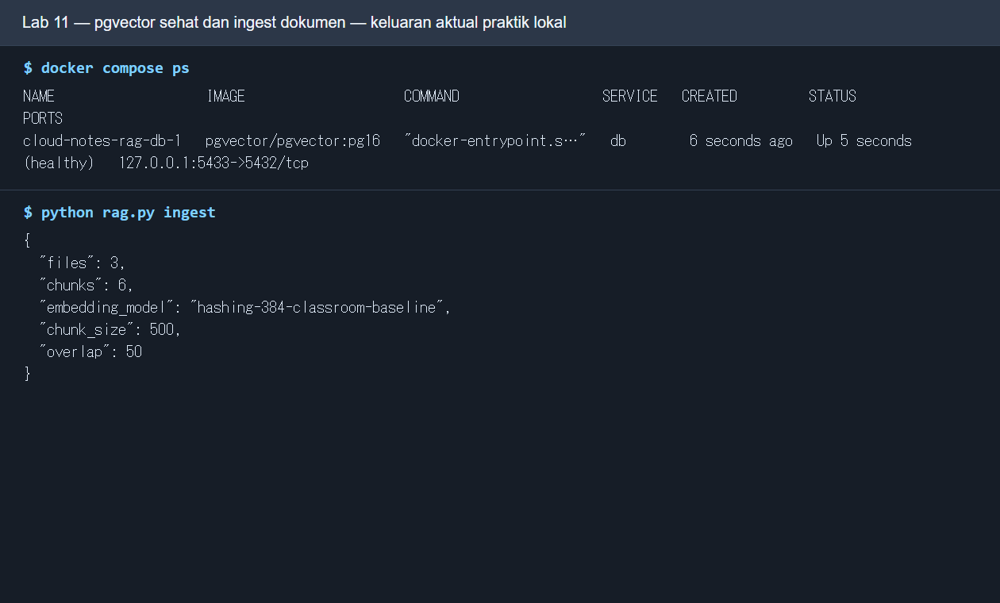

* **Langkah:** Jalankan `docker compose up -d --wait`, lalu `python rag.py ingest` dari root repo Lab 11. **Fungsi:** Menyiapkan pgvector dan mengisi indeks dokumen. **Cara kerja:** Compose menunggu DB healthy; ingest memecah file, membuat embedding, lalu menyimpan chunk di PostgreSQL. **Baca hasil:** Cari `healthy` dan ringkasan 3 file/6 chunk pada mode hash contoh.

**Langkah 2 — chat web dan sitasi.** Ajukan pertanyaan lalu baca kalimat jawaban bersama `[S1]`, nama file, indeks bagian, dan jarak sumber.

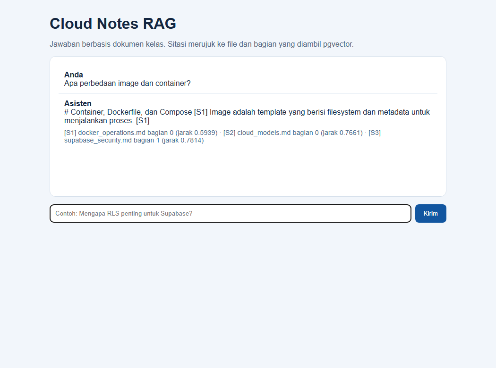

* **Langkah:** Jalankan `python -m uvicorn app:app --host 127.0.0.1 --port 8011`, buka web, lalu ajukan pertanyaan. **Fungsi:** Menguji jalur chat RAG dari browser. **Cara kerja:** Frontend POST ke API; API mencari chunk terdekat di pgvector dan menyusun jawaban bersitasi. **Baca hasil:** Baca pertanyaan, jawaban, dan tanda sumber `[S1]` sebelum mempercayai isinya.

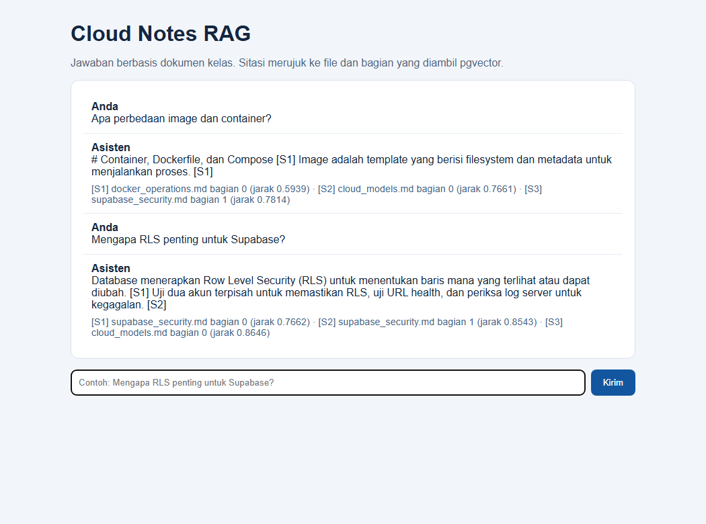

* **Langkah:** Di web RAG, kirim dua pertanyaan dan buka daftar sumber pada hasil. **Fungsi:** Memeriksa apakah jawaban ditopang dokumen yang relevan. **Cara kerja:** Retriever mengembalikan top-K chunk dengan nama file, nomor bagian, dan jarak, lalu jawaban menyitirnya. **Baca hasil:** Cocokkan tiap klaim `[S1]` dengan kutipan sumber; label saja tidak menjamin jawaban benar.

**Langkah 3 — API web.** Dokumentasi FastAPI memperlihatkan route `POST /api/ask` yang sama dengan perintah terminal.

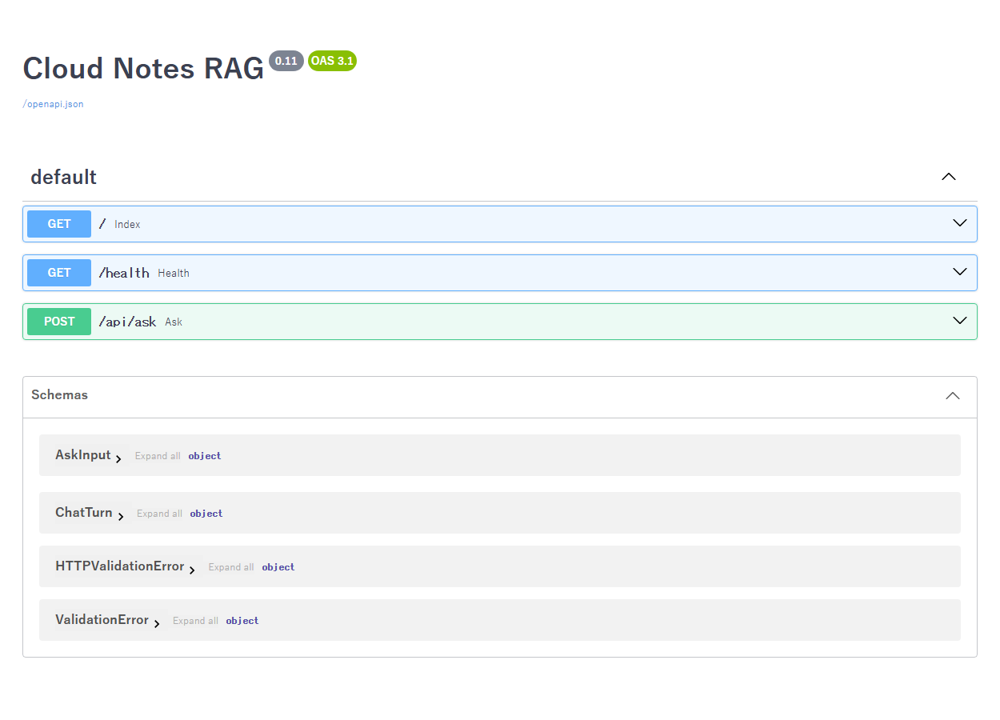

* **Langkah:** Saat Uvicorn hidup, buka `http://127.0.0.1:8011/docs` dan perluas `POST /api/ask`. **Fungsi:** Menunjukkan kontrak API RAG yang sama dengan UI/terminal. **Cara kerja:** FastAPI menghasilkan halaman OpenAPI dari model request/response pada server. **Baca hasil:** Baca field `question` dan `top_k`, lalu bandingkan respons dengan hasil web.

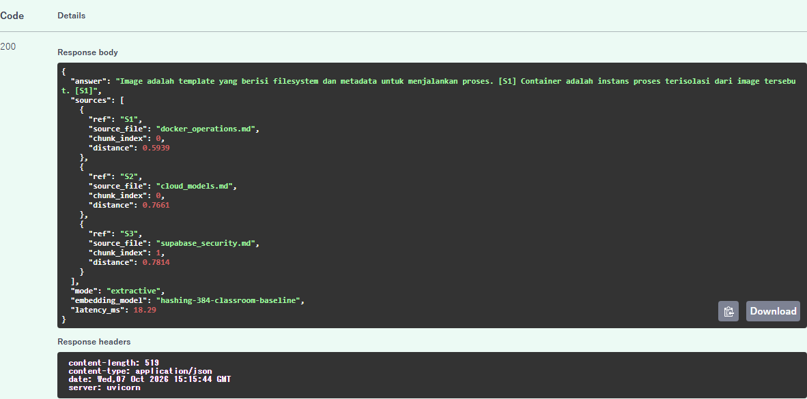

* **Langkah:** Kirim `{"question":"Apa perbedaan image dan container?","top_k":3}` dengan `Invoke-RestMethod` atau tombol **Try it out → Execute** pada `/docs`. **Fungsi:** Memeriksa jalur API secara terpisah dari chat web. **Cara kerja:** FastAPI memvalidasi JSON, mengambil tiga sumber melalui pgvector, lalu mengirim jawaban ekstraktif. **Baca hasil:** HTTP **200**, jawaban berpenanda `[S1]`, dan `sources` dengan `source_file`, `chunk_index`, serta `distance`. Screenshot ini berasal dari respons server lokal yang dijalankan.

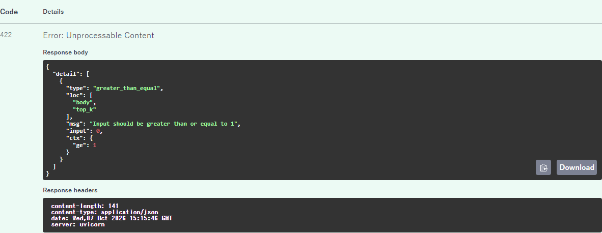

* **Langkah:** Ulangi POST dengan `{"question":"uji","top_k":0}`. **Fungsi:** Menguji batas input sebelum query database. **Cara kerja:** Pydantic menolak `top_k` di luar 1–10; handler jawaban tidak dipanggil. **Baca hasil:** HTTP **422**, `loc` menunjuk `body.top_k`, dan pesan meminta nilai minimal 1. Screenshot ini adalah respons server lokal yang dijalankan.

**Langkah 4 — benchmark.** Tiga pertanyaan contoh menghasilkan durasi dan jumlah sumber. Hasil tiap mesin dapat berubah. Baris `Hasil:` pada gambar menunjuk path sementara mesin uji; pada komputer Anda, lokasi file benchmark mengikuti folder kerja dan konfigurasi sendiri.

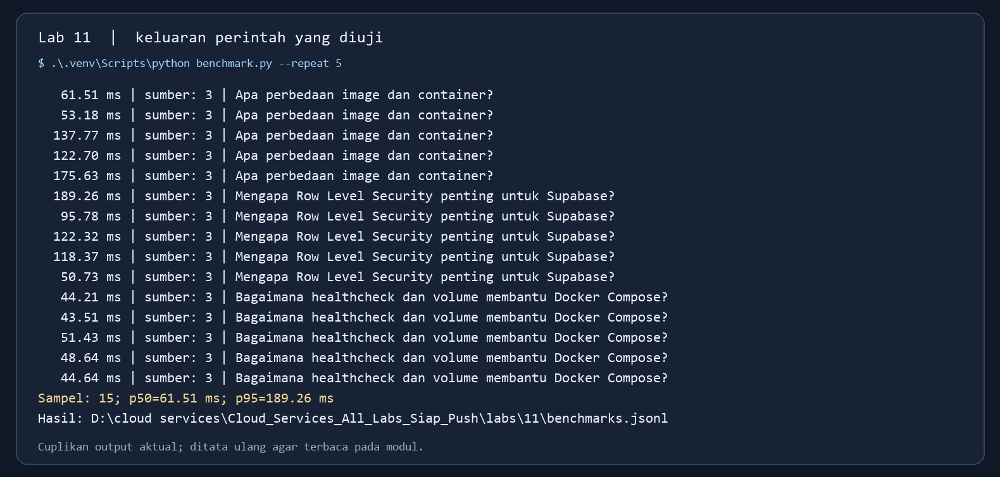

* **Langkah:** Jalankan `python benchmark.py` pada mode embedding yang dipilih. **Fungsi:** Mengukur latensi query dan jumlah sumber RAG. **Cara kerja:** Skrip mengulang pertanyaan contoh, mencatat durasi tiap run, dan menghitung median/p95 nearest-rank. **Baca hasil:** Baca waktu dan top-K per pertanyaan; path file dan angka latensi mesin Anda dapat berbeda.

**Langkah 5 — tambah dokumen.** Pada salinan uji, satu file contoh yang aman dinaikkan ke `docs/`, lalu ingest ulang menaikkan total menjadi 4 file/7 chunk. Bandingkan dengan hasil dokumen Anda sendiri.

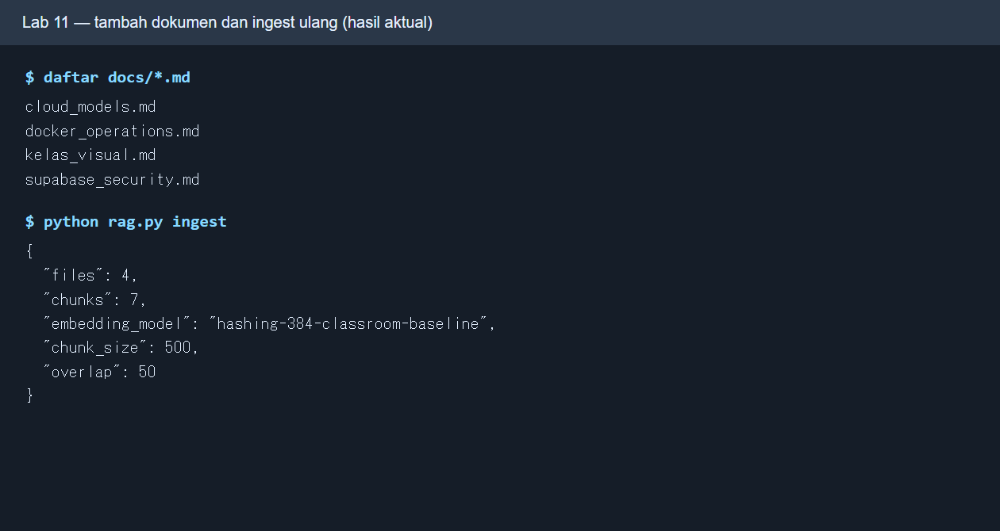

* **Langkah:** Tambahkan satu file aman ke `docs/`, lalu jalankan ulang `python rag.py ingest`. **Fungsi:** Menguji pembaruan korpus RAG. **Cara kerja:** Ingest membaca file baru, memecahnya menjadi chunk, dan menambah/memperbarui indeks pgvector. **Baca hasil:** Bandingkan daftar file dan total chunk; contoh naik dari 3 file/6 chunk ke 4 file/7 chunk.

**Mode semantik opsional lokal:** instal `requirements-semantic.txt`, ubah `EMBED_MODE=semantic` hanya di `.env`, lalu ingest ulang. MiniLM memiliki batas 256 token model; kode menyesuaikan ukuran chunk setelah decode/re-encode agar tidak memotong teks diam-diam. Pada dokumen contoh uji paket menghasilkan 20 chunk semantik, seluruhnya dalam batas. Model pertama kali diunduh dan membutuhkan RAM/disk/waktu lebih besar. Bandingkan hash vs semantik dengan pertanyaan yang sama, kemudian kembalikan mode hash dan ingest lagi bila kelas melanjutkan baseline.

## Pertanyaan untuk laporan

1. Mengapa vector hash kelas disebut baseline leksikal, bukan semantic embedding?
2. Apa pengaruh ukuran chunk dan overlap pada recall, latensi, serta kemungkinan konteks terpotong?
3. Mengapa query top-K dengan jarak cosine kecil belum otomatis menjamin jawaban benar?
4. Mengapa tabel/fungsi RAG lokal tidak boleh langsung dibuka pada proyek Supabase publik tanpa RLS/grants?

## Bukti, Git, dan penutup

Salin [template laporan](hasil/TEMPLATE_LAPORAN.md) menjadi `hasil/lab11.md`. Sertakan alur pipeline, jumlah chunk, dua jawaban dan sitasi, screenshot **hasil Anda sendiri**, benchmark, perbandingan mode bila dicoba, serta jawaban pertanyaan. Dari root repo Lab 11:

```bash
git status --short
git add .
git diff --cached --name-only
git diff --cached --check
git commit -m "lab11: rag pgvector dan sitasi"
git push
```

Simpan bukti milik Anda di `hasil/bukti/` bila ada; laporan tetap perlu memuat bukti hasil sendiri. Jangan commit `.env`, password DB, model cache, key Groq, atau benchmark berisi dokumen pribadi. Lihat [panduan Git](PANDUAN_GIT.md). Jalur Groq/Supabase/Vercel pada [README Lab 11](README.md) memerlukan akun dan aman hanya dengan secret server serta kebijakan akses dokumen.

Hentikan Uvicorn dengan `Ctrl+C`; dari root repo Lab 11 jalankan `docker compose down`. Volume mempertahankan data latihan. Tambahkan `-v` **hanya** bila data boleh dihapus. Jika ingest gagal, cek DB `docker compose ps`, file password lokal, dan port 5433. Jika UI menampilkan sumber tidak relevan, periksa dokumen serta mode embedding yang dipakai, bukan hanya menaikkan `top_k`.

## Challenge kerja sehari-hari: asisten pengetahuan internal — kunci lengkap

Kasus: staf operasi perlu jawaban cepat dari tiga dokumen kelas dan harus dapat menelusuri sumbernya. Jalur wajib sepenuhnya lokal: PostgreSQL/pgvector di Docker, Python hash embedding, jawaban ekstraktif, dan UI/API. Tidak perlu key Groq, Supabase, atau GPU. Jalankan dari root repo Lab 11; PowerShell memakai `.\.venv\Scripts\python`, Bash memakai `.venv/bin/python`.

1. **Nyalakan database.** Salin file contoh `.env` serta password seperti bagian Persiapan, lalu `docker compose up -d --wait` dan `docker compose ps`. Kunci: `cloud-notes-rag-db-1` **healthy**, port host **5433** menuju container **5432**. Secret dibaca dari file lokal, bukan ditaruh di command line atau Git.
2. **Bangun indeks.** Jalankan `.\.venv\Scripts\python rag.py ingest` (PowerShell) atau `.venv/bin/python rag.py ingest` (Bash). Kunci korpus bawaan: `files=3`, `chunks=6`, `embedding_model=hashing-384-classroom-baseline`, `chunk_size=500`, `overlap=50`. Ini hashing leksikal 384 dimensi; angka token adalah token demo regex, bukan token LLM.
3. **Bandingkan liveness dan readiness.** Jalankan server `.\.venv\Scripts\python -m uvicorn app:app --host 127.0.0.1 --port 8011` di terminal terpisah. Buka `http://127.0.0.1:8011/health` dan `/ready`. Kunci: `/health` memberi `status=ok` bila proses API hidup; `/ready` memberi `status=ready`, jumlah `chunks>0`, dan mode embedding yang cocok bila DB/index siap. Sebelum ingest atau ketika DB mati, readiness 503. Pulihkan DB/index sebelum melanjutkan.
4. **Tanya lewat CLI, web, dan API.** CLI: `.\.venv\Scripts\python rag.py ask "Apa perbedaan image dan container?"`. Web: buka `http://127.0.0.1:8011`, kirim pertanyaan yang sama dan `Mengapa RLS penting untuk Supabase?`. API PowerShell: `Invoke-RestMethod http://127.0.0.1:8011/api/ask -Method Post -ContentType application/json -Body '{"question":"Apa perbedaan image dan container?","top_k":3}'`. Bash: `curl -fsS http://127.0.0.1:8011/api/ask -H 'Content-Type: application/json' -d '{"question":"Apa perbedaan image dan container?","top_k":3}'`. Kunci: jawaban mempunyai `[S1]` dan daftar sumber berisi nama file, bagian, serta jarak. Cocokkan isi kalimat dengan dokumen, jangan menganggap tanda sitasi otomatis menjamin kebenaran.
5. **Uji input salah.** Kirim `{"question":"uji","top_k":0}` ke endpoint yang sama. Kunci **HTTP 422** karena `top_k` dibatasi 1–10 pada model API. Pertanyaan kosong juga ditolak validasi. Jangan mengubah database untuk menguji error ini.
6. **Evaluasi latensi.** Jalankan `.\.venv\Scripts\python benchmark.py --repeat 5` atau `.venv/bin/python benchmark.py --repeat 5`. Kunci: **15 sampel** (3 pertanyaan × 5), masing-masing melaporkan tiga sumber, lalu p50 median dan p95 nearest-rank. Angka milidetik bergantung mesin; pada salah satu uji lokal p50=61,51 ms dan p95=189,26 ms. `benchmarks.jsonl` adalah hasil lokal yang diabaikan Git.
7. **Tambahkan pengetahuan baru.** Buat file Markdown aman, misalnya `docs/prosedur_kelas.md`, berisi satu prosedur operasi yang tidak mengandung password/token. Jalankan ingest lagi dan bandingkan `files/chunks` dengan baseline. Jika satu chunk baru, contoh hasil menjadi 4 file/7 chunk. Tanya tentang prosedur itu; bila sumber tidak muncul pada top-K, periksa isi dokumen dan representasi hash sebelum mengklaim model salah. Setelah eksperimen, pilih apakah file aman itu layak disimpan di repo; jika dihapus, ingest ulang agar indeks konsisten.
8. **Checker menyeluruh.** Saat Docker, indeks, dan Uvicorn hidup, jalankan `.\.venv\Scripts\python -B tests\challenge.py` atau `.venv/bin/python -B tests/challenge.py`. Kunci **10 PASS, 0 FAIL**: vektor/chunk, p95, liveness/readiness, jawaban dan sumber, mode tanpa API berbayar, validasi 422, serta sitasi ekstraktif.


*Perintah/tindakan:* `docker compose up -d --wait; docker compose ps; python rag.py ingest`. *Fungsi:* menyiapkan DB vektor dan indeks. *Cara kerja:* Compose menunggu healthcheck PostgreSQL; Python memotong tiga dokumen dan menyimpan enam vektor. *Baca hasil:* container healthy, 3 file/6 chunk pada korpus bawaan.

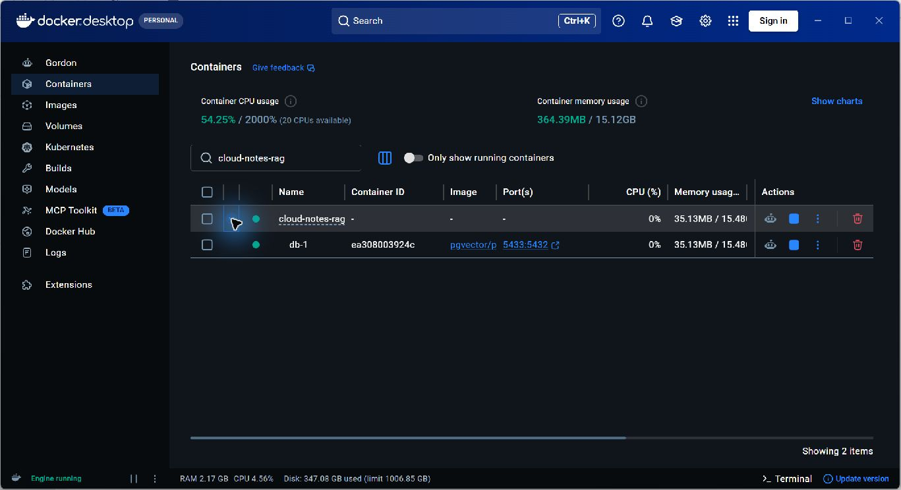

*Perintah/tindakan:* `docker compose up -d --wait`, lalu buka tab Containers di Docker Desktop. *Fungsi:* melihat DB yang mendukung RAG. *Cara kerja:* Compose menjalankan `pgvector/pgvector:pg16` dan meneruskan port host 5433 ke port PostgreSQL 5432 di container. *Baca hasil:* grup `cloud-notes-rag` dan `db-1` hijau/healthy. Server Python Uvicorn port 8011 berjalan terpisah, sehingga tidak muncul sebagai container pada gambar ini.

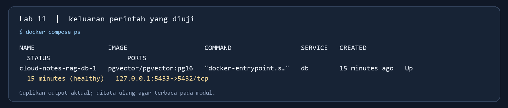

*Perintah/tindakan:* `docker compose ps`. *Fungsi:* memeriksa nama service, image, health, dan pemetaan port tanpa membuka GUI. *Cara kerja:* Compose membaca keadaan container yang aktif. *Baca hasil:* db healthy dan `127.0.0.1:5433->5432/tcp`; output aktual ditata ulang agar terbaca, bukan screenshot terminal langsung.

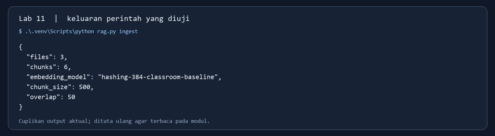

*Perintah/tindakan:* `.\.venv\Scripts\python rag.py ingest` atau `.venv/bin/python rag.py ingest`. *Fungsi:* membangun indeks korpus. *Cara kerja:* script membaca tiga dokumen, membuat chunk/vektor, dan menulis metadata ke pgvector. *Baca hasil:* 3 file, 6 chunk, mode hash, 500/50; keluaran aktual ditata ulang untuk modul, bukan screenshot terminal langsung.

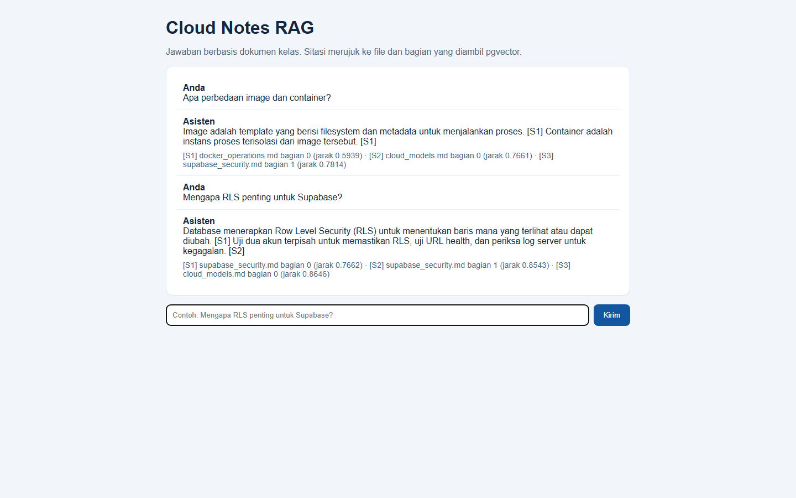

*Perintah/tindakan:* jalankan Uvicorn, buka web, kirim dua pertanyaan. *Fungsi:* menunjukkan percakapan dan sitasi. *Cara kerja:* UI POST `/api/ask`, server mengambil top-K pgvector lalu menyusun jawaban ekstraktif. *Baca hasil:* `[S1]` pada kalimat, nama file serta jarak pada daftar sumber; periksa isi sumber sebelum memakai jawaban.

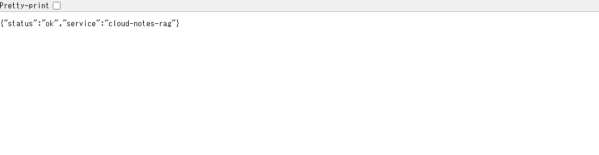

*Perintah/tindakan:* buka `http://127.0.0.1:8011/health` atau jalankan `Invoke-RestMethod http://127.0.0.1:8011/health`. *Fungsi:* memeriksa proses HTTP. *Cara kerja:* endpoint menjawab tanpa memeriksa isi indeks. *Baca hasil:* `status=ok`; ini belum menjamin query RAG siap. Tangkapan layar adalah halaman JSON lokal aktual.

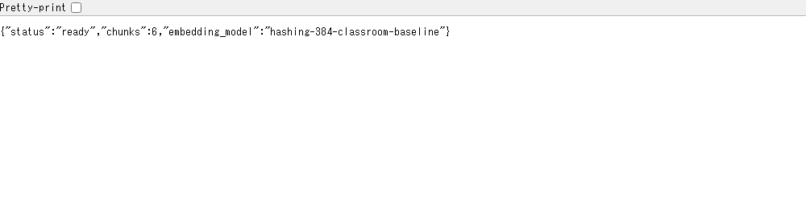

*Perintah/tindakan:* buka `http://127.0.0.1:8011/ready` atau jalankan `Invoke-RestMethod http://127.0.0.1:8011/ready`. *Fungsi:* memastikan DB dan indeks siap dipakai. *Cara kerja:* server memeriksa koneksi, jumlah chunk, dan kesesuaian mode embedding. *Baca hasil:* `status=ready`, `chunks=6`, dan model hash pada korpus bawaan; screenshot berasal dari halaman JSON lokal aktual.

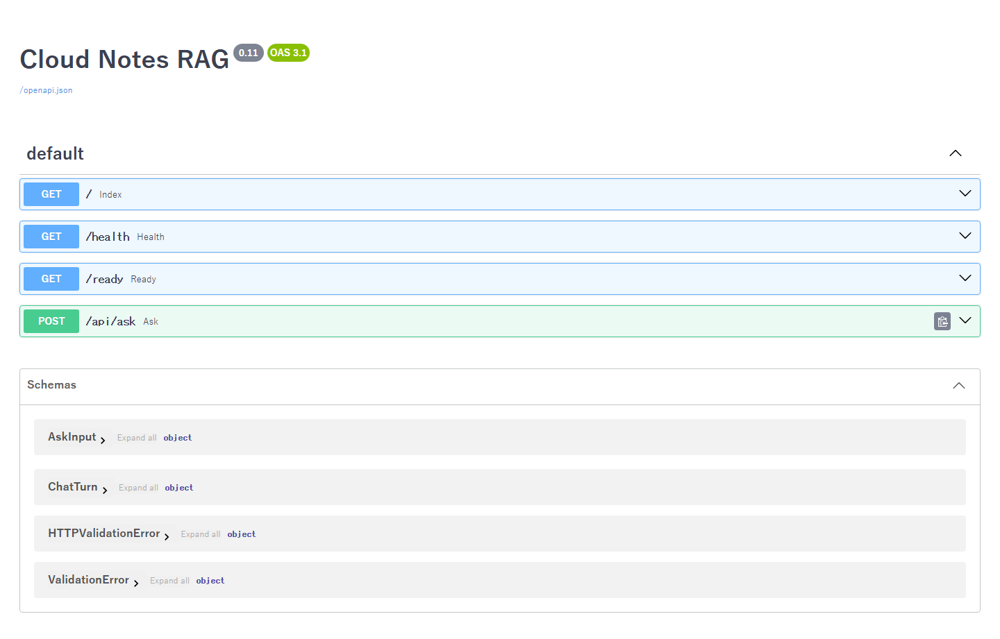

*Perintah/tindakan:* buka `http://127.0.0.1:8011/docs`. *Fungsi:* melihat kontrak API. *Cara kerja:* FastAPI menghasilkan dokumentasi dari model request dan endpoint. *Baca hasil:* temukan `/health`, `/ready`, dan `POST /api/ask` dengan `question/top_k`.


*Perintah/tindakan:* POST `{"question":"Apa perbedaan image dan container?","top_k":3}` ke `/api/ask`, melalui PowerShell `Invoke-RestMethod` atau **Execute** pada `/docs`. *Fungsi:* membuktikan API menjawab di luar antarmuka chat. *Cara kerja:* server memvalidasi payload, memanggil retriever pgvector, lalu membangun jawaban dari chunk. *Baca hasil:* HTTP 200, jawaban `[S1]`, tiga sumber, dan jarak.


*Perintah/tindakan:* POST `{"question":"uji","top_k":0}` ke `/api/ask`. *Fungsi:* menguji validasi batas parameter. *Cara kerja:* Pydantic menolak nilai sebelum query ke pgvector. *Baca hasil:* HTTP 422 dengan lokasi error `body.top_k` dan syarat minimal 1.

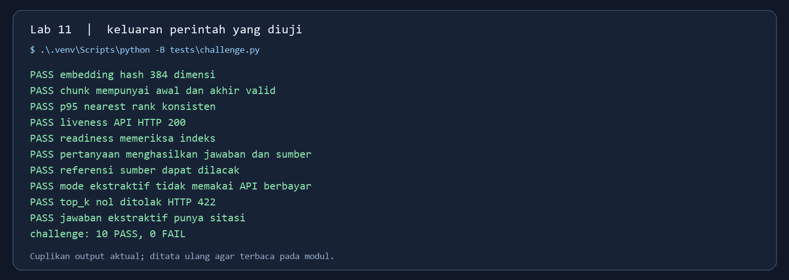

*Perintah/tindakan:* `.\.venv\Scripts\python -B tests\challenge.py` atau `.venv/bin/python -B tests/challenge.py`. *Fungsi:* memastikan DB, indeks, API, validasi, serta sitasi. *Cara kerja:* sepuluh pemeriksaan memanggil fungsi Python dan HTTP lokal. *Baca hasil:* 10 PASS, 0 FAIL; cuplikan output aktual ditata ulang.

### Jawaban pertanyaan laporan

1. Hash embedding mengelompokkan kata ke bucket angka, sehingga kemiripan terutama berasal dari tumpang tindih token, bukan pemahaman makna seperti model semantik. Ia dipakai agar semua mahasiswa dapat berlatih tanpa unduhan model besar.
2. Chunk kecil dapat menaikkan presisi bagian tetapi memecah konteks; chunk besar memuat lebih banyak konteks tetapi bisa melampaui batas model, menambah biaya/latensi, dan mengaburkan bagian relevan. Overlap mengurangi kehilangan kalimat di batas chunk dengan harga duplikasi penyimpanan dan retrieval.
3. Jarak cosine kecil hanya menunjukkan kedekatan dalam embedding yang dipakai. Dokumen bisa salah, query ambigu, atau jawaban mengutip kalimat di luar pertanyaan. Periksa sumber dan evaluasi dengan pertanyaan serta jawaban acuan.
4. Tabel/fungsi lokal tidak memiliki kebijakan akses per pengguna untuk internet publik. Di Supabase publik, atur RLS, grants, kepemilikan dokumen, dan fungsi dengan hak yang tepat sebelum memberi akses; jangan bocorkan key server/LLM atau dokumen pribadi.

**Bukti laporan:** status Docker healthy, hasil ingest, dua jawaban beserta sumber, respons HTTP 422, screenshot web sendiri, p50/p95, checker 10 PASS, dan penjelasan keamanan. Jalur semantic/Groq opsional hanya dicoba bila waktu, perangkat, izin data, dan akun memadai.
